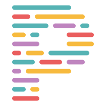
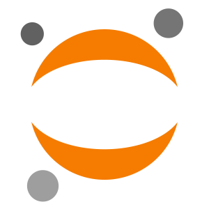
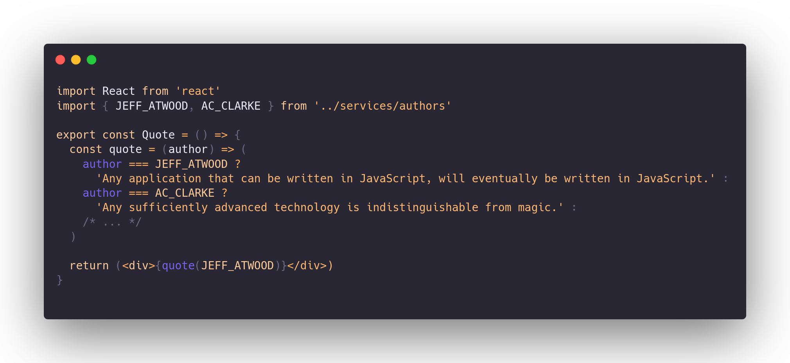

# Hi there, I'm vanntile! 👋

[](https://shields.io/)
[](http://commonmark.org)
[](https://github.com/vanntile?tab=followers)

```javascript
const vanntile = {
    handle: "@vanntile",
    tagline: "developer by choice & designer for fun",
    languages: {
        programming: ["JavaScript (ES2019)", "TypeScript ⌨️", "Python 3 🐍", "C/C++", "Haskell"],
        markup: ["HTML 5 🏠", "Markdown ⬇️", "JSON", "YAML"],
        styling: ["CSS 3 💅"]
    },
    paradigm: "functional programming ➡️",
    frameworks: ["Angular 🛡️", "React ⚛️", "express", "Django", "Flask ⚗️", "GTK+ (gtkmm)"],
    tooling: {
        essentials: ["Node.js 🐢🚀", "npm 📦", "Docker 🐳"],
        editors: ["VSCodium", "vim"],
        linters: ["Prettier", "ESLint", "clang-format"],
        graphics: ["Inkscape", "Figma", "GIMP"]
    },
    versioning: ["git 🍴", "GitHub 🐙", "GitLab 🦊"],
    system: {
        family: "Linux 🐧",
        operatingSystem: "Ubuntu"
    },
    darkTheme: true,
    passions: ["reading", "jojo", "all things JavaScript"]
}
```

## Links 🔗💬

Find me online:

<a href="https://github.com/vanntile"></a>
<a href="https://gitlab.com/vanntile"></a>
<a href="https://stackoverflow.com/users/4679160/vanntile-ianito"></a>
<a href="https://www.linkedin.com/in/valentin-ionita/"></a>
<a href="https://dribbble.com/vanntile"></a>


## Coding-related images 💾

**Languages**


**Frameworks, tools, other snappy stuff**


<br/>


<br/>







<br/>


## Some stats 📊
*GitHub stats is provided through [anuraghazra](https://github.com/anuraghazra/)'s [GitHub README stats](https://github.com/anuraghazra/github-readme-stats/)*

[](https://github.com/vanntile/github-readme-stats) [](https://stackoverflow.com/users/4679160/vanntile-ianito)

## to-think-about 📜


