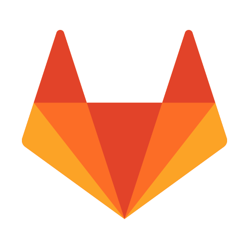

# Hi there, I'm vanntile! 👋

[](https://shields.io/)
[](http://commonmark.org)
[](https://github.com/vanntile?tab=followers)

```javascript
const me = {
  handle: '@vanntile',
  tagline: 'developer by choice & designer for fun',
  languages: {
    programming: [
        'JavaScript (ES2021)', 'TypeScript', 'Go 🇬', 'Python 3 🐍',
        'C/C++', 'Haskell λ',
    ],
    markup: ['JSON', 'YAML', 'HTML', 'Markdown', 'MDX'],
    styling: ['CSS 💅'],
  },
  frameworks: {
    frontend: ['Astro 🚀', 'NextJS 🇳', 'React ⚛️', 'Vue 🇻', 'Angular 🛡️'],
    styling: 'Tailwind CSS 🍃',
    backend: ['FastAPI ⚡ [.py]', 'Express [.js]', 'Django [.py]', 'Flask [.py]'],
    other: ['GTK/gtkmm [.cpp]', 'unified [.md]'],
  },
  testing: ['Robot 🤖 [.py]', 'Cypress [.js]', 'Jest 🃏[.js]', 'JUnit [.java]'],
  tools: ['Deno 🦕', 'Node.js 🟩', 'npm 📦', 'Docker 🐳', 'Jenkins 🎩'],
  platforms: [
    'GitHub 🐙', 'GitLab 🦊', 'Bitbucket 🪣',
    'Heroku', 'Linode', 'Mastodon 🐘',
  ],
  standardsAndParadigms: [
      'FOSS', 'OpenAPI', 'REST', 'GraphQL', 'functional programming',
      'semantic web', 'semantic commits',
  ],
  graphics: ['Inkscape', 'Figma', 'GIMP', 'SVG'],
  others: {
    versioning: 'git',
    operatingSystem: {
      family: 'Linux 🐧',
      distro: 'Pop!_OS',
    },
    apps: ['Obsidian', 'VSCodium', 'vim', 'Jupyter'],
    formattersAndLinters: [
      'Prettier', 'ESLint', 'gofumpt', 'clang-format', 'commitlint'
    ],
    preferredTheme: 'dark',
    dotfiles: true,
  },
};

```

## Links 🔗

Find me online:

<a href="https://vanntile.com"></a>
<a href="https://github.com/vanntile"></a>
<a href="https://www.linkedin.com/in/valentin-ionita/"></a>
<a href="https://fosstodon.org/@vanntile"></a>
<a href="https://stackoverflow.com/users/4679160/vanntile-ianito"></a>
<a href="https://gitlab.com/vanntile"></a>
<a href="https://dribbble.com/vanntile"></a>


## Speaking code in images 💾

**Languages**

<div>
    
    
    
    
    
    
</div>


**Frameworks, tools, other snappy stuff**

<div>
    
    
    
    
    
    
</div>
<br/>
<div>
    
    
    
    
    
    
    
</div>
<br/>
<div>
    
    
    
    
</div>
<br/>
<div>
    
    
    
</div>
<br/>
<div>
    
    
    
    
    
    
    
    
    
</div>
<br/>
<div>
    
    
    
    
    
    
    
</div>

